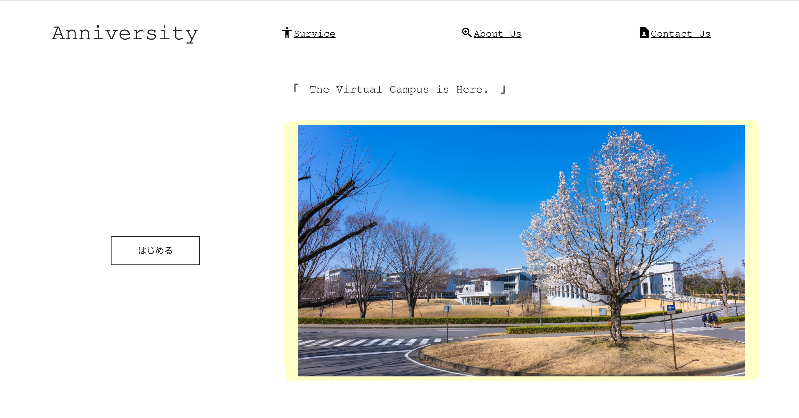

# 仮想キャンパスツール / todoリスト
- レポートの管理
- 授業情報の交換及び共有
- 時間割機能

# DEMO

# Features
- レポート管理機能により、オンライン授業で蓄積しがちなレポートを適切に管理。
- 各授業ごとに個別のチャットルームを用意。授業情報の交換・共有が可能。
- 自らの履修を検索画面から登録。時間割として自動反映。

# Dependency
- PHP (>= 7.2.5)
- Laravel 6.2
- MySQL
- Bootstrap 5.0
- Heroku

# Usage

- ①　https://secure-harbor-95867.herokuapp.com/ にアクセス
- ②　トップページの画像横「はじめる」ボタンをクリック
- ③　デモユーザーでログイン
    - Mail: `emily@example.com`
    - Password: `demonstration`
- ④　マイページへ遷移ののち、画面上部のnavbarにある「授業検索＆登録画面へ移動」をクリック。
- ⑤　講義名に「講義1」と入力し検索。（教授名は空白、設置キャンパスについては任意で選択）画面右に結果が出たら「講義１」をRegisterボタンで登録。上部のnavbarからマイページへ移動。
- ⑥　マイページに登録されていることが確認されたら、緑のRと書いてあるボタンを押し、レポート追加画面へ。
- ⑦　レポート追加画面にて、必須事項を記入。追加ボタンをクリック。
- ⑧　自動的にマイページへと遷移するため、navbarから「レポート管理画面」へ移動。正しく追加したレポートが入っていれば、赤の「提出完了」ボタンをクリック。
　　　画面下の「Completed Report」に該当レポートが移動していることを確認し、マイページへ戻る。
- ⑨　次に講義１の下にある水色のボタンをクリックしチャット画面へ。
- 10 チャット画面は複数人のユーザーによる利用を前提としているため、チャット画面の使用自体は初期データを見ていただきたいですが、
　　　実際にチャットしてみたいという場合には、「トップへ戻るー>はじめるー>新規登録の方はこちら」をクリックし、新たにユーザーを登録して④⑤⑨の手順を行ってから、各ユーザーのチャット画面から会話をしてみてください。

# Note
- 今後の機能追加として、「授業情報の提供者と受け手の間の相互評価システム」を考えている。
- 授業に出ている学生が「欠席している学生に情報を無償であげたくない」「同一の情報を複数人に渡すのは不正のリスクが伴う」などの考えに及ぶ場合があるため。
  適切な評価が下されているか、適切な情報が与えられているかなどは運営側できちんと確認できるようにしていきたい。
- 全体のタイムラインのようなものを用意し、サークルやゼミ、課外活動等の広報として使える場も設けたい
